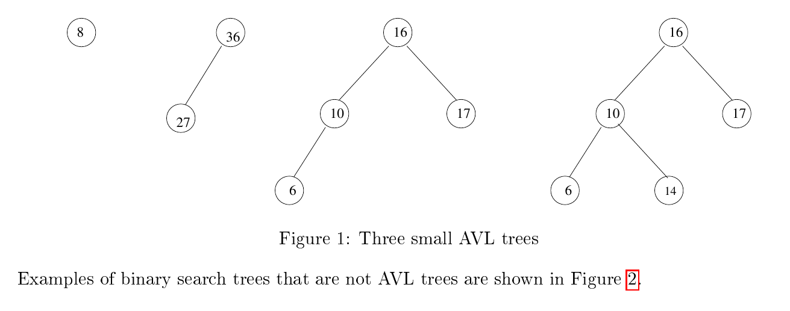
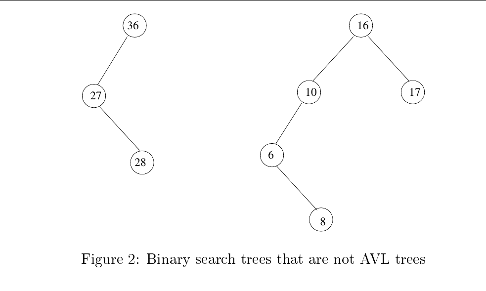
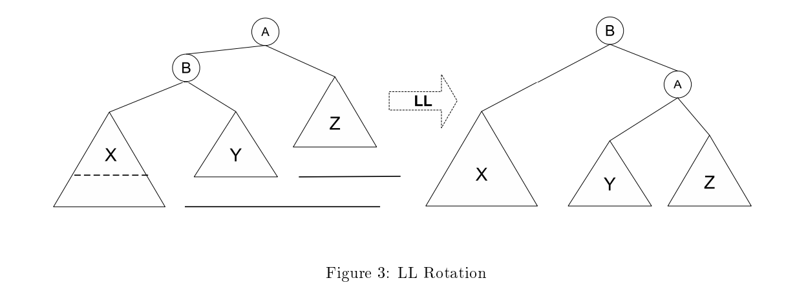
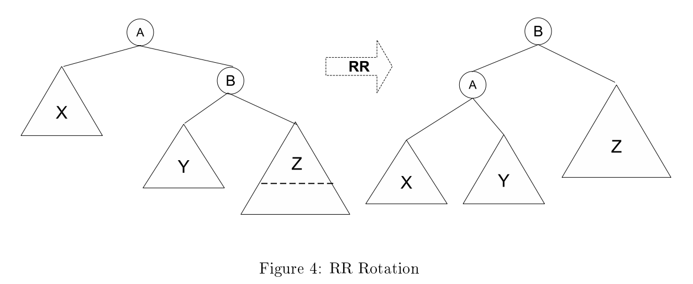
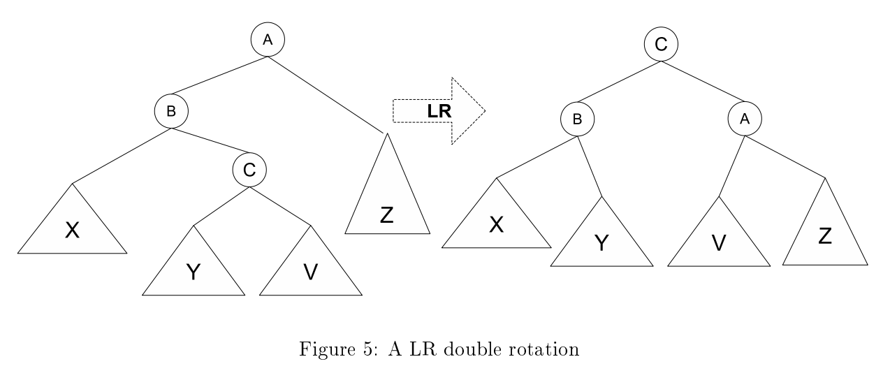
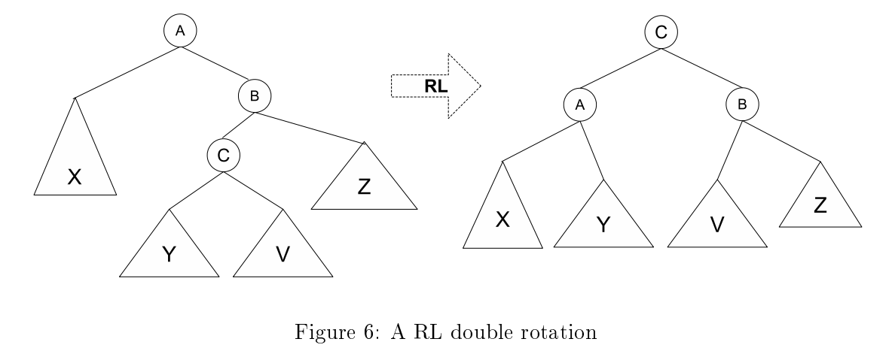

# Balanced Trees

## Breadth First Search on Binary Search Trees
Breadth-First Search (BFS) for a binary tree is a traversal method where nodes are visited level by level, starting from the root and proceeding to the next level. This approach is also known as level-order traversal. Here's an explanation of how BFS works for a binary tree:

### Steps to Perform BFS
1. **Start at the Root:** Begin with the root node of the binary tree.
2. **Use a Queue:** Use a queue data structure to keep track of nodes to visit. A queue ensures that nodes are visited in the order they are added (FIFO: First In, First Out).
3. **Visit Nodes Level by Level:**
   * Dequeue the node at the front of the queue.
   * Process the node (e.g., print its value).
   * Enqueue the left child of the node (if it exists).
   * Enqueue the right child of the node (if it exists).
4. **Repeat:** Continue this process until the queue is empty.

### Example
#### Given Binary Tree:
```markdown
       1
      / \
     2   3
    / \   \
   4   5   6
```

#### BFS Traversal:
1. Start with the root: ```1```.
2. Enqueue ```1```. Queue: ```[1]```.
3. Dequeue ```1```, process it, and enqueue its children (```2``` and ```3```). Queue: ```[2, 3]```.
4. Dequeue ```2```, process it, and enqueue its children (```4``` and ```5```). Queue: ```[3, 4, 5]```.
5. Dequeue ```3```, process it, and enqueue its right child (```6```). Queue: ```[4, 5, 6]```.
6. Dequeue ```4```, process it (no children to enqueue). Queue: ```[5, 6]```.
7. Dequeue ```5```, process it (no children to enqueue). Queue: ```[6]```.
8. Dequeue ```6```, process it (no children to enqueue). Queue: ```[]```.
**Result:** The BFS traversal is: ```1, 2, 3, 4, 5, 6```.

#### c++ code:
```c++
void BFS(BinarySearchTree& t)
{
    std::queue<Node*> q;

    if(t.getRoot())
    {
        std::cout<<t.getRoot()->data<<std::endl;
        q.push(t.getRoot());
    }
    
    int nodes_per_level = 1;
    while(!q.empty())
    {
        for(int i=0;i<nodes_per_level;i++)
        {
            Node* n = q.front();
            q.pop();
            if(n->left)
            {
                std::cout <<" -> "<< n->left->data;
                q.push(n->left);
            }
            if(n->right)
            {
                std::cout <<" -> "<< n->right->data;
                q.push(n->right);
            }
        }
        std::cout<<std::endl;
        nodes_per_level=q.size();
    }
}
```

### Key Points
* BFS is suitable for exploring all nodes level by level.
* It uses a queue to maintain the order of exploration.
* BFS is different from Depth-First Search (DFS)(used in pre-order,post-order, and in-order), which explores as far as possible along each branch before backtracking.


## Inorder Depth First Search on Binary Search Tree 

### What is Inorder Traversal?
Inorder = Left → Node → Right

For a BST, this yields nodes in ascending order.

### Recursive Pseudocode:
```cpp
void inorder(TreeNode* root) {
    if (root == nullptr) return;
    inorder(root->left);
    visit(root);           // e.g., print or store value
    inorder(root->right);
}
```

### Example Tree:
        5
       / \
      3   7
     / \   \
    2   4   8

### Output of Inorder Traversal:
2, 3, 4, 5, 7, 8

### Time & Space Complexity:
- Time: O(n) — every node is visited once
- Space: O(h) — due to recursion stack
    - O(log n) for balanced tree
    - O(n) for skewed tree

### Key Point:
Inorder traversal of a BST gives a sorted list of values.


## AVL Trees
We could define a perfectly balanced binary search tree with N nodes to be a complete binary
search tree, one in which every level except the last is completely full. A perfectly balanced BST
would have guaranteed O(logN) search time. Unfortunately it is too costly to rebalance such a tree
after each insertion and deletion. We need a tree with a weaker balancing condition. An AVL tree
is such a tree. An AVL tree (AVL for the names of its inventors, Adelson-Velskii and Landis) is a
binary search tree with a balancing condition that is relatively inexpensive to maintain.

**Definition 1.** An AVL tree is a binary search tree in which, for every node in the tree, the
heights of the left and right subtrees of the node differ by at most 1. This is called the *balancing
condition*.

> **Note:** We will see that a consequence of this definition is that the height of an AVL tree with N
> nodes, even in the worst case, is proportional to logN.

For the sake of precision, we will define the balance factor at a node as the height of the left
subtree of that node minus the height of the right subtree of that node.



Examples of binary search trees that are not AVL trees are shown in the next figure.

## AVL Tree Search

A search takes O(h) time, where h is the height of the tree. This is because an AVL tree is a binary
search tree and the search algorithm is the same for both trees. This is the easy part. Because the
height of an AVL tree is at worst O(logN), searching takes O(logN) time in the worst case.

We will establish this later in this chapter.




### AVL Tree Insertion

When an element is inserted into a tree, whether as a left child or a right child of some node p, the
height of the tree rooted at p may or may not increase. If p had a left child but no right child, and
the new node is p's new right child, the tree rooted at p does not change height as a result of the
insertion. But if p had no children at all and this is a new child, then p's tree increased height by
1. In this case it is possible that the tree rooted at the parent of p increased in height as well, and
that the tree rooted at the grandparent of p increased in height as well.

If you look at the trees in Figure 1 and imagine inserting a node containing 4 as the left child of 6 in either of the two
rightmost trees, you can see that each of the trees all of the way up the path to the root increased
in height. On the other hand, if you insert 18 as the right child of 17, then the tree rooted at 17
increases in height but not that of its parent.

We can conclude that an insertion might increase the height of one or more subtrees by 1. This
will change the balance factors of the trees on the path up to the root from the point of insertion.
Some of the trees will stay balanced, meaning their balance factors are -1, 0, or 1, whereas others
may now have a balance factor of -2 or +2.

For example, consider the tree that is the second from the right in Figure 1. If we give a new left child to node 6, then its balance factor changes from 0 to 1 and the balance factor of the node containing 10 changes from 1 to 2.

Consider traveling up the tree from the point of insertion, inspecting the balance condition at each
node. The first node found that is out of balance (not -1, 0, or 1) can be out of balance in one of four
ways. An analysis shows that of the four different cases, two are symmetric. There are therefore
two theoretical cases and their symmetric counterparts. Let A be the node of greatest depth that is
out of balance, meaning the first one found while traveling up the path from the point of insertion.

The four possibilities are:

1. The insertion was in the left subtree of the left child of A  
2. The insertion was in the right subtree of the left child of A  
3. The insertion was in the left subtree of the right child of A  
4. The insertion was in the right subtree of the right child of A  



We will see that there are four different rebalancing algorithms that restore the AVL tree's balance
condition at all of its nodes. For now, these algorithms will be known as the LL, RR, RL, and LR
rotations. Soon they will be explained.
Cases 1 and 4 are symmetric and are resolved with an LL or RR rebalancing respectively. Cases 2
and 3 are symmetric and are resolved with an LR or RL rebalancing respectively.


### The Single Rotations

The LL and RR rotations are called single rotations. They are symmetric to each other. Although
the RR is symmetric, this does not mean that it can use the same code; it cannot, as will become
evident. The LL rotation is depicted in Figure 3. The LR and RL rotations are called double
rotations. We will get to them later.



In the LL rotation in the figure, the left child of A is labeled B. B has two subtrees labeled X and
Y, and A has a right child labeled Z. In the LL rotation, B rotates up to take the place of A, and A
becomes B's right child. B keeps its left subtree, X, but it gives its right tree to A, which “adopts”
it as its left subtree.



We now explain why the LL single rotation does not increase the height of the tree rooted at the
unbalanced node, A. To see this you have to observe the following facts. Let h be the height of tree
X after the insertion. The tree rooted at A has height h + 2 because there is an edge from A to B
and an edge from B to the root of X.

1. Since all nodes below A are in balance, the tree rooted at B is in balance, which implies that
   height(X) − height(Y) < 2

2. If height(Y) = height(X) after the insertion, then before the insertion, the tree rooted at A
   would not have been an AVL tree, since the left subtree of B (i.e., X) would have had the same
   height that it has after the insertion, and it is not an AVL tree now. Therefore, height(X) =
   height(Y) + 1.

3. Since the tree rooted at A is not an AVL tree now, height(X) - height(Z) ≥ 2. If height(X) -
   height(Z) > 2, then it would not have been an AVL tree before the insertion, so height(X) -
   height(Z) = 2.

4. It follows that height(Y) = h − 1 and height(Z) = h − 1. They are the same height.

5. After the rotation, the left subtree of B has height h + 1 relative to B, and the right subtree
   has height (h − 1 + 2) = h + 1 relative to B. Thus the tree has height h + 1, which is the height
   that the tree was prior to the insertion.

6. This shows that the subtree rooted at B is restored to the height it had prior to the insertion,
   which implies that no further rebalancing is necessary.

A single rotation is performed once and the tree is restored to an AVL tree at a cost of a few pointer
assignments. Balance factors or height information needs to be updated in the nodes along the path
to the point of rotation, but this is no more than O(logN) steps. A full analysis follows after we
explain the double rotations.

An example of a function to perform the LL rotation follows, assuming that the height() function
returns -1 when its argument is NULL. It is also assumed that this function is only called if the
tree rooted at k2 needs an LL rotation. Otherwise there is a chance that a null pointer will be
dereferenced. If the tree needs an LL rotation at k2, then k2->left is not null, so k2->left->right
cannot be a null-pointer dereference. It is also important to observe that the height function used
in this code returns a -1 if its argument is a null pointer.

```cpp
void LL_rotation( AvlNode * & k2 )
{
    AvlNode *k1 = k2->left;
    k2->left = k1->right;
    k1->right = k2;
    k2->height = max( height( k2->left ), height( k2->right ) ) + 1;
    k1->height = max( height( k1->left ), k2->height ) + 1;
    k2 = k1;
}
```
It is not hard to write the RR rotation after examining the above code. 



### The Double Rotations

The LR and RL rotations are called double rotations because they can actually be implemented
by two successive single rotations. It is easier to see it though as a single operation, and that is how
it is explained in these notes. The double rotations are required because a single rotation would not
rebalance in this case, as you can verify with an example.

To perform the double rotation, travel up the tree from the point of insertion until you reach a node
that is no longer in balance. Call this node A. All nodes on the path from the point of insertion up
to but not including A remained in balance but A is out of balance. Figure 1.2.1 depicts the LR
rotation.

The LR rotation is used when the insertion is in the right subtree of the left child of A. Therefore,
the right subtree of the left child of A has grown in height by 1. We do not know whether it is the
left or right subtree of this tree, i.e., whether it is the subtree labeled Y or V in Figure 1.2.1, but
it does not matter. In the figure, the root of the right child of the left child of A is C. To do the
double LR rotation, make C the new root, replacing A, make its parent B its left child and make
the old root, A, the right child of C. Because C is now the root and it had two children, it must
give up its old subtrees for adoption. It gives Y to B and V to A, as illustrated.


The rotation reduces the height of the tree by 1 for similar reasons as above. If h is the height of Y
(or V) after the insertion, then height(X) must be h also. Height(Z) must be h + 1. It cannot be
less. Why? After the rebalancing, the tree rooted at B has height h + 2, which is the height it had
prior to the insertion. Thus, the rest of the tree remains in balance and no further actions need to
be performed.

### Analysis of Insertion Time
If no rotation is performed, the insertion takes O(h) steps. If any rotation is performed, regardless
of which it is, the height of the rebalanced subtree is reduced to what it was prior to the insertion.
(So then how can a tree grow in height?) This implies that the height of the tree after rebalancing
is the height that it was before the insertion. Therefore, since the tree was an AVL tree before
the insertion, all ancestor nodes were in balance and they remain in balance after the insertion
and rebalance. This implies that once the rebalancing has been done, the insertion is complete.
Rebalance takes constant time; therefore insertion takes O(h) steps for the search plus a constant
for the rebalancing.

### The Insertion Implementation
There are two ways to implement the insertion algorithm. In a sense the simplest is to modify the
BST insertion code with the inclusion of a call to a single function to rebalance the tree. This is
what the the fourth edition of the Weiss textbook does. The alternative is to embed the rotations
in the insert() function directly. I include both methods for the purpose of illustration.
The method using a single call to a balance function needs to define a height function that returns -1
if the pointer is NULL, and the height stored in the node otherwise. This function and the balance()
function as well as the version of insert() using them is in the following listing.

```cpp
static const int ALLOWED_IMBALANCE = 1;

int height(AvlNode* t) const {
    return t == nullptr ? -1 : t->height;
}

// Assume t is balanced or within one of being balanced
void balance(AvlNode*& t) {
    if (t == nullptr)
        return;

    if (height(t->left) - height(t->right) > ALLOWED_IMBALANCE) {
        if (height(t->left->left) >= height(t->left->right))
            LL_rotation(t);
        else
            LR_rotation(t);
    } 
    else if (height(t->right) - height(t->left) > ALLOWED_IMBALANCE) {
        if (height(t->right->right) >= height(t->right->left))
            RR_rotation(t);
        else
            RL_rotation(t);
    }

    t->height = std::max(height(t->left), height(t->right)) + 1;
}

void insert(const Comparable& x, AvlNode*& t) {
    if (t == nullptr) {
        t = new AvlNode{x, nullptr, nullptr};
    }
    else if (x < t->element) {
        insert(x, t->left);
    }
    else if (t->element < x) {
        insert(x, t->right);
    }

    balance(t);
}
```

You can verify that the logic of the balance() function is correct. Note that because the insert()
function is recursive, the balance() function will be called at each level of recursion. It will not do
any work after any of the rotations are called, because these rotations will adjust the heights of the
subtrees and later called to check the height balance will find them within the allowed limit.
A version of insert() that embeds the rotations directly follows:
```cpp
void insert(const Comparable& x, AvlNode*& t) const 
{
    if (t == nullptr) 
        t = new AvlNode(x, nullptr, nullptr);
    
    else if (x < t->element) 
    {
        insert(x, t->left);
        
        //this part finds the A(first unbalanced node from the way up) from image
        // if x < t->element, that means the first turn was an l 
        if (height(t->left) - height(t->right) == 2) 
        {
            //this part finds the second turn, 
            if (x < t->left->element)
                LL_rotation(t);
            else
                LR_rotation(t);
        }
    }

    //symetric reasoning to above
    else if (t->element < x) 
    {
        insert(x, t->right);

        if (height(t->right) - height(t->left) == 2) 
        {
            if (t->right->element < x)
                RR_rotation(t);
            else
                RL_rotation(t);
        }
    }

    else 
    {
        // Duplicate; do nothing
    }

    //update height of A
    t->height = std::max(height(t->left), height(t->right)) + 1;
}

```

## Rotation functions
```cpp

void LL_rotation(AvlNode*& k2) 
{
    AvlNode* k1 = k2->left;
    k2->left = k1->right;
    k1->right = k2;

    k2->height = std::max(height(k2->left), height(k2->right)) + 1;
    k1->height = std::max(height(k1->left), height(k1->right)) + 1;

    k2 = k1;
}

void RR_rotation(AvlNode*& k2) 
{
    AvlNode* k1 = k2->right;
    k2->right = k1->left;
    k1->left = k2;

    k2->height = std::max(height(k2->left), height(k2->right)) + 1;
    k1->height = std::max(height(k1->left), height(k1->right)) + 1;

    k2 = k1;
}

void LR_rotation(AvlNode*& t) 
{
    // RR_rotation(t->left);
    // LL_rotation(t);

    //or
    AvlNode* k1 = t->left;
    AvlNode* k2 = k1->right;

    // Perform rotation
    k1->right = k2->left;
    t->left = k2->right;
    k2->left = k1;
    k2->right = t;

    // Update heights
    k1->height = std::max(height(k1->left), height(k1->right)) + 1;
    t->height = std::max(height(t->left), height(t->right)) + 1;
    k2->height = std::max(k1->height, t->height) + 1;

    // Move new root into position
    t = k2;
}

void RL_rotation(AvlNode*& t) 
{
    // LL_rotation(t->right);
    // RR_rotation(t);
    //or
    AvlNode* k1 = t->right;
    AvlNode* k2 = k1->left;

    // Perform rotation
    k1->left = k2->right;
    t->right = k2->left;
    k2->right = k1;
    k2->left = t;

    // Update heights
    k1->height = std::max(height(k1->left), height(k1->right)) + 1;
    t->height = std::max(height(t->left), height(t->right)) + 1;
    k2->height = std::max(k1->height, t->height) + 1;

    // Move new root into position
    t = k2;
}
```

## Attribution
This repository contains derivative work based on course materials by Professor Stewart Weiss for CSCI 335 at Hunter College, CUNY, Spring 2019.

Original materials are available at: [https://www.cs.hunter.cuny.edu/~sweiss/course_materials/csci335/csci335_s19.php](https://www.cs.hunter.cuny.edu/~sweiss/course_materials/csci335/csci335_s19.php)

The original work is licensed under the [Creative Commons Attribution-ShareAlike 4.0 International License (CC BY-SA 4.0)](https://creativecommons.org/licenses/by-sa/4.0/).  
This repository is licensed under the same license. Changes include summarization, reorganization, and additional commentary.
