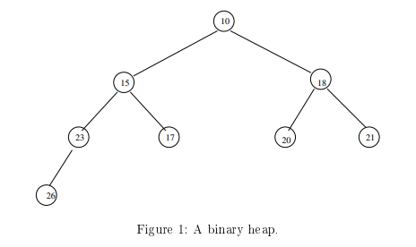
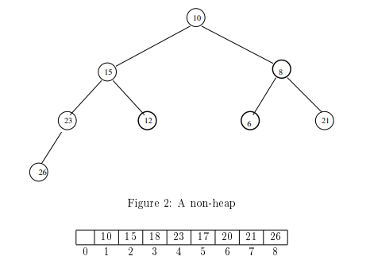
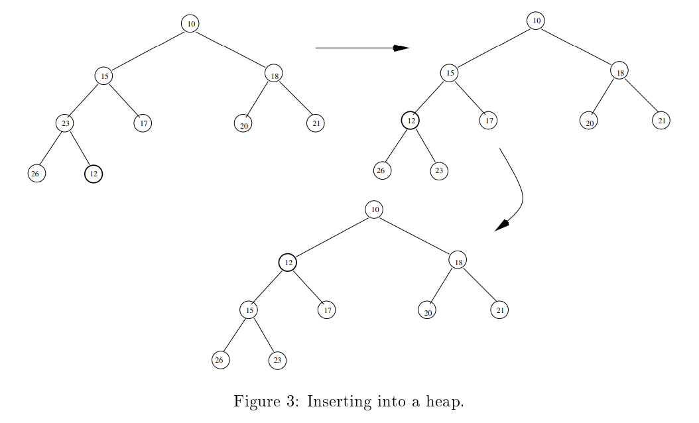
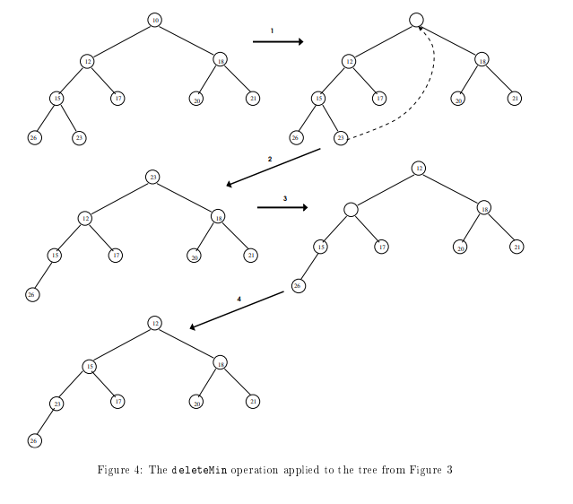
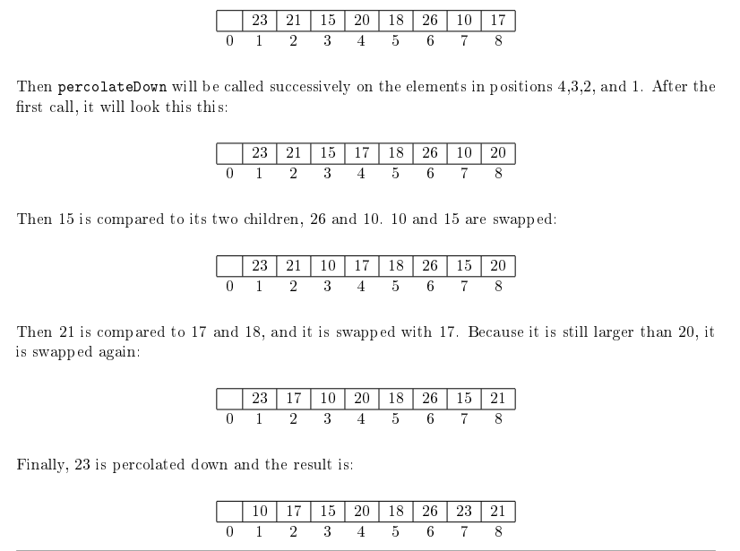

# Chapter 5: Priority queues

## Introduction
Many applications require a special type of queuing in which items are pushed onto the queue by
order of arrival, but removed from the queue based on some other priority scheme. A priority
scheme might be based on the item's level of importance for example. The goal in this chapter is
to investigate efficient data structures for storing data in this fashion.

### Examples
* Process or job queue: Operating systems enqueue processes as they are created or woken up
from some state of inactivity, placing them at the rear of the queue, but they usually pick the
highest priority process in the queue to run next.
* Task lists in general: Task lists, such as project schedules or shopping lists, are often constructed by adding items to the rear of a list as they are thought of, in their order of arrival,but tasks are removed from the list and completed in some specific priority ordering, such as due date or order of importance.


A queue that supports an ordinary **insertion** operation at its rear, and a deletion operation that deletes according to some priority ordering is called a **priority queue**. Since the highest priority
element can always be thought of as the minimum element in some appropriate numeric ordering,
this delete operation is called **deleteMin**. For example, priority numbers can be assigned to the
items so that priority 0 is the highest priority; priority 1 is second highest; 2, third highest, and
so on. Therefore, a priority queue is a queue that supports a deleteMin operation and an insert
operation. No other operations are required.

The question is, what is a good data structure for this purpose. The performance measure of interest
is not the cost of a single operation, but of a sequence of n insertions and deleteMin operations,
in some arbitrary, unspecified order. Remember that a queue is only a buffer, in other words, a
temporary storage place to overcome short term variations in the rate of insertion and deletion. In
the long run, the size of a queue must remain constant otherwise it implies that the two processes
inserting and deleting are mismatched and that sooner or later the queue will get too large. Therefore
the number of insertions must be equal to the number of deleteMins in the long run.


## Naïve Implementations
The naïve approach, i.e., the first one to come to mind, is to use an ordinary queue as a priority
queue. Insertion is an O(1) operation and deletion is O(n), where n is the current size of the queue,
since the queue must be searched each time for the minimum element. An alternative is to use a
balanced binary search tree instead of a queue. Insertions and deletions in a balanced binary search
tree are both O(log n), but the overhead is high anyway.
The first suggestion, using an ordinary queue, will require $O(n^2)$ operations in the worst case.
This is because it will require roughly n/2 insertions, which is O(n), since each insertion takes
constant time, and n/2 deletions, but each deletion takes time proportional to the queue size at
the time of the deletion. In the worst case, all insertions take place first and the deletions take
n/2 + (n/2 − 1) + (n/2 − 2) + ... + 2 + 1 = $O(n^2)$ steps. On average, the insertions and deletions
will be intermingled and the average queue size for a deletion will be n/4. This still leads to $O(n^2)$
steps on average.
The use of a binary tree requires a slightly more complicated analysis.
These solutions are not efficient. They do not use the information available at the time of the
insertion. When an item is inserted, we know its value. Knowing its value is a piece of information
that can be used to position it within the queue data structure so as to make future deleteMin
operations more efficient.


## Binary Heaps: An Efficient Implementation
A **binary heap** is a special kind of binary tree. Usually the word "binary" is dropped from the
term and it is just called a heap. In order to explain what it is, you need to remember some of the
basic facts about binary trees. Therefore, we start with a review of the required concepts.


### Full and Complete Binary Trees
A binary tree of height h is full, or perfect, if there are $2^h$ nodes at depth h. This implies that all
levels less than h are full, because there could not be $2^h$ nodes at depth h unless there were $2^{h−1}$
nodes in level h − 1 and each had two children. The same argument applies to that level, and then
to the level above it, and so on. (We could prove this by mathematical induction easily enough, but
it is fairly obvious.) Since for each level $k, 0 \leq k \leq h$, there are $2^k$ nodes in that level,<br><br>

**Theorem 1:** A full binary tree of height h has 1 + 2 + 22 + 23 + · · · + 2h = 2^{h+1} − 1 nodes.<br><br>

A binary tree of height h is complete if the tree of height h-1 rooted at its root is full, and the
bottom-most level is filled from left to right. This is an informal definition. The formal one includes
the requirement that, if a node at depth h − 1 has any children, then all nodes to the left of that
node have two children, and if it has only one child, that child is a left child. Since a complete tree
of height h consists of a full tree of height h − 1 and between 1 and $2^h$ nodes in level h, it follows
from the preceding theorem that it has at least $2^{h−1+1} − 1 + 1 = 2^h$ nodes and at most $2^{h+1} − 1$ nodes.<br><br>
**Theorem 2:** The number of nodes in a complete binary tree of height h is at least $2^h$ and at most $2^{h+1} − 1$.<br><br>
Since $\lfloor log 2^h \rfloor = h$ and $\lfloor log(2^{h+1} − 1) \rfloor = h$, we have proved:<br><br>
**Corollary 3:** The height of a complete binary tree with n nodes is $\lfloor log n \rfloor$.

**Corollary 4:** In a complete binary tree with n nodes, the highest index non-leaf node is the node
with index b(n/2)c.<br><br>

**Proof:** The highest index non-leaf node has a left child and possibly a right child, and no node to
its right has any children. If n is even, the last node is a left child of its parent, and the parent is
the node with index $\lfloor (n/2) \rfloor$. (We will prove this in Theorem 6 below.) If n is odd, the last node is a right child of its parent, and the parent has index $\lfloor (n/2) \rfloor$ also.
Since the highest-indexed non-leaf node in a complete binary tree with n nodes has index b(n/2)c,
there are n − $\lfloor (n/2) \rfloor$ leaf nodes in the tree. If n is even, this is n/2 exactly, and if n is odd, this is
n/2+1. We have proved:<br><br>
**Corollary 5:** In a complete binary tree with n nodes, the last n/2 nodes are leaf nodes.<br><br>

## The Heap Order Property
A binary tree has the **heap order property** if every node is smaller than or equal to its two
children. Since each node has this property, it is not hard to prove by induction on the height of
a node in the tree that every node is smaller than or equal to all of its descendants. A **heap** is a
**complete binary tree with the heap-order property**. It follows from the definition that the
root of a heap is the minimum element in the tree. Figure 1 illustrates an example of a binary heap.
Notice that each node is the root of a tree with the heap order property, which means that each
subtree is also a heap. Figure 2 shows a binary tree that does not have the heap-order property.
The emboldened nodes are smaller than their parents.<br><br>



## Heaps and Arrays
A heap can be implemented easily in an ordinary array if the root is placed in index 1 instead of
index 0. As an example, consider the array below, containing the keys, 10, 15, 18, 23, 17, 20 , 21,
26.<br><br>
<br><br>

This array represents the binary tree shown in Figure 1. It is important to remember that when an
array is used to represent a heap, the root is in index 1, not 0.
With this in mind, define three functions leftchild(k), rightchild(k), and parent(k) as follows:
* leftchild(k) is the index of the left child of the node whose index is k,
* rightchild(k) is the index of the right child of the node with index k, and
* parent(k) is the index of the node which is the parent of node with index k.

Then we can prove
**Theorem 6:** If the nodes in a complete binary tree are numbered in breadth-first order, from left to
right in each level, with the root assigned index 1, then
* leftchild(k) = 2k if $k \leq n/2$
* rightchild(k) = 2k + 1 if $k < n/2$
* parent(k) = $\lfloor(k/2)\rfloor$ if $k > 1$

**Proof:** Assume that k is the index of an arbitrary node such that $k \leq n/2$. Suppose node k has a
left child. If it has a left child, then by the definition of a complete binary tree, the entire level to
the right of node k must be filled, and the entire level to the left of the left child must also be filled.
Let d be the depth of node k in the tree. There are $2^d − 1$ nodes in the tree above level d because a
full binary tree of height d-1 has $2^d − 1$ nodes. So how many nodes are to the left of node k in its
level? It must be<br><br>
$k-(2^d − 1)-1 = k − 2^d$

How many nodes are to the right of k in level d? It must be $2^d$ less the number of nodes up to and
including k, which is<br><br>
$2^d − (k − 2^d) − 1 = 2(2^dd) − k − 1 = 2^{d+1} − k − 1$<br><br>
Each child to the left of node k contributes 2 children in level d + 1 to the left of node k's left child,
so there are 2(k-2^d) nodes to the left of leftchild(k) in level d + 1. Since there are 2^{d+1}-k-1 nodes
to the right of node k in level d, the index of the left child of node k is:<br><br>
leftchild(k) = $k + (2^{d+1})-k-1 + 2(k-2^d) + 1$<br>
= $2^{d+1} − 1 + 2k − 2^{d+1} + 1$<br>
= 2k <br><br>

The right child, if it exists, must have index 2k+1. Finally, since leftchild(k) = 2k and rightchild(k) =
2k + 1, it follows that parent(k) = $\lfloor k/2 \rfloor$.

This theorem establishes that the index of a node is all we need to find its children or its parent,
which means we do not need a data structure with pointers to represent a heap. This implies two
important benefits of using an array to represent a heap:
* array indexing is much faster than dereferencing pointers, making access faster in general, and
* space is saved because of the absence of pointers in each node.


## Algorithms
In all of the code that follows, we assume that the heap class is defined as a template class whose
element type is a Comparable. In other words, it is of the form
```cpp
template <class Comparable>
class heap
{
    public:
        // all public methods here
    private:
        Comparable array[MAX_SIZE+1];
        int current_size;
};
```

We do not provide a full description of the public interface to this class, nor do we provide implementations of its constructors, destructors, and various other methods. Instead we concentrate on the three important algorithms: inserting into a heap, deleting the minimum element, and building
a heap. Obviously, obtaining the minimum element is trivial, as it is just array[1], so this is not
discussed either. Our version of deleteMin does not return the minimum element, but it is an easy
change to do that.


### Insertion
The algorithm to insert a new item into a heap is simple: we put the element at the end of the array,
i.e., after the last item currently in the array, which, viewed as a binary tree, is in the bottom-most
level to the right of the rightmost key. If the tree is full, the new item starts a new level. The tree
may not be a heap anymore, because the item may be smaller than its parent. Therefore, we need to
check if this is true and restore the heap order property. To make this clear, suppose that the data
is in an array named array, that it has current_size elements, and that the item was just inserted
into position k=current_size+1. Then the following code snippet will correct this problem:
```cpp
if (array[k] < array[parent(k)])
    swap(array[k], array[parent(k)]);
```

Since parent(k) is just k/2, this simplifies to
```cpp
if (array[k] < array[k/2])
    swap(array[k], array[k/2]);
```
If the child was swapped with its parent, it is possible, that it is also smaller than its new parent,
i.e., what was its grandparent before the swap. So this is repeated. In fact it may need to repeat
all the way back to the root of the heap. This suggests that we need code of the form
```cpp
current_size++; // increment the size of the array
k = current_size;
while ( array[k] < array[k/2] ) {
swap(array[k], array[k/2]);
k = k/2;
}
```

But this has a problem, because it fails to check whether k has reached the root (i.e., whether k==1).
so it should be
```cpp
current_size++; // increment the size of the array
k = current_size;
while ( (k > 1) && array[k] < array[k/2] ) {
swap(array[k], array[k/2]);
k = k/2;
}
```

Finally, it is silly to keep swapping the element upward. Instead we can just keep it in a variable,
say new_item, and "slide" the parents into the hole that it creates when it would be swapped. The
algorithm that does this is called **upward percolation**. Upward percolation is the act of upwards
percolate it up to the top as far as necessary to restore the heap-order. Suppose that the heap stores
its data in an array named array, and that current_size is the current size of that array. Assume
that we have functions to check if the array is full. Then our insert function becomes the following.
<br><br>
```cpp
template < class Comparable >
void heap < Comparable >:: insert ( const Comparable & new_item )
{
    if (isFull())
        throw Overflow();
    // Percolate up
    int hole = ++ current_size ;
    while ( hole > 1 && new_item < array [hole/2] ) 
    {
        array [ hole ] = array [ hole / 2 ];
        hole = hole /2;
    }
    array[hole] = new_item ;
}
```

**Example** Figure 3 shows how the insertion algorithm behaves when items are inserted into the
heap from Figure 1.

### Deleting the Minimum Element
The deleteMin algorithm is also very easy to implement. To delete the smallest element, we remove
the root. Now there is a hole where the root used to be. We take the last element of the heap,
meaning the rightmost leaf in the bottom level, and put it where the root was. It might be bigger
than its children though, so we have to handle this problem. We pick the smaller of the two children
and swap it with the root. We must pick the smaller, otherwise we would be destroying the heaporder property, because the larger child would be the parent of the smaller child. We need to repeat this until either the element is smaller than both of its children, or it has been swapped down until it became a leaf node.

This process, in which an element that is too big for its position in the heap is repeatedly pushed
down in the heap until it settles on top of a subtree whose elements are all larger than it, is called
**downward percolation**. Because downward percolation is an algorithm that is used in other
methods for maintaining a heap, we make it a helper function, as follows:

```cpp
// hole is the position containing an element that might need to be
percolated down
template < class Comparable >
void heap < Comparable >:: percolateDown ( int hole )
{
    int child ;
    Comparable temp = array [ hole ]; // copy the element for later
    insertion
    while ( 2* hole <= current_size ) 
    {
        child = hole * 2; // left child of hole
        if ( child != current_size && array [ child + 1] < array [ child ] )
            // right child exists and is smaller than left , so make child
            its index
        child ++;
        if ( array [ child ] < temp )
            // copy smaller child into hole
            array [ hole ] = array [ child ];
        else break ; // both children are bigger than hole
        // repeat with hold being child that was copied up
        hole = child ;
    }
    array [ hole ] = temp ;
}
```

Now the deleteMin function is easy:

```cpp
template < class Comparable >
void heap < Comparable >:: deleteMin ( )
// or you can make it
// void heap < Comparable >:: deleteMin ( Comparable & min_item )
// and set min_item = array [1]
{
    if ( isEmpty ( ) )
        throw Underflow ( ) ;
    array[1] = array[current_size];
    current_size--;
    percolateDown(1);
}
```

**Example** Figure 4 illustrates how the deleteMin algorithm works. The root element is replaced
by the last element, in this case 23. Then the percolateDown function is called to move 23 into
the position in which it belongs. Because 12 is the smaller of its two children, 12 is moved to the
root. Then 23 is compared to 15 and 17, and 15, the smaller, is moved up. Since the hole that 15
left has just a single child, 26, and 23 < 26, 23 is inserted into the hole.



A heap with n keys is built by inserting the n keys into an initially empty heap in any order
without maintaining the heap property. After all items are in the tree, it is "heapified". A
binary tree can be converted into a heap by starting at the level just above the lowest level and
percolating down all keys that are too big. When this level is finished, the next level up is processed,
and so on, until we reach the root. Since Corollary 4 tells us that the highest index non-leaf node
has index $\lfloor n/2 \rfloor$, we only need to percolate down the nodes at indices n/2, n/2 − 1, n/2 − 2, . . . , 1.
The algorithm makes use of the PercolateDown() helper function described above and is given
below:
```cpp
template < class Comparable >
void heap < Comparable >:: heapify ()
{
    for ( int i = n /2; i > 0; i - -)
        percolateDown ( i ) ;
}
```

**Example** In this example, we just work directly on the array. You can draw the complete binary
tree at each stage to visualize it becoming a heap. Suppose that the initial array has the following
data:<br><br>


### Analysis of heapify()
Now it is time to do a little math and establish why building a heap this
way is actually very efficient. We will prove the following theorem.<br><br>

**Theorem 7:** Heapifying a binary tree with n nodes takes O(n) time.<br><br>

Observe that n steps are needed to insert n items into the heap, without restoring the heap order
property after each insertion, if an array is used, since each insertion takes O(1) steps. Then
heapifying the entire array requires that each of the nodes from the root to the level above the
bottom be percolated. In the worst case, each of these is moved to the lowest level. Thus, the
total number of steps in heapifying is equal to the sum of the heights of these nodes in the heap.
It is sufficient to show that the sum of the heights of the nodes in a heap is O(n). We start by
establishing the following lemma.

**Lemma 8:** The sum of the heights of the nodes in a full (perfect) binary tree of height h is:
$$
(2^{h+1} - 1) - (h + 1)
$$

**Proof:** There are $2^h$ nodes at height 0. There are $2^{h−1}$ nodes at height 1, $2^{h−2}$ at height 2,
and so on, until there is but $1 = 2^0 = 2^{h−h}$ node at height h. In general, there are $2^k$ nodes at
height $h − k$. Since nodes at height 0 add nothing to the sum, the total height sum S is:

$$
S = \sum_{k=1}^{h} k \cdot 2^{h-k} \tag{1}
$$

Doubling both sides gives:

$$
2S = \sum_{k=1}^{h} k \cdot 2^{h-k+1} \tag{2}
$$

Separate out the (k = 1) term:

$$
2S = 2^h + \sum_{k=2}^{h} k \cdot 2^{h-k+1} \tag{3}
$$

And also write:

$$
S = h + \sum_{k=1}^{h-1} k \cdot 2^{h-k} \tag{4}
$$

Now subtract Eq. (4) from Eq. (3):

$$
S = (2^h + \sum_{k=2}^{h} k \cdot 2^{h-k+1}) - \left(h + \sum_{k=1}^{h-1} k \cdot 2^{h-k}\right)
$$

We observe:

$$
\sum_{k=2}^{h} k \cdot 2^{h-k+1} = \sum_{k=1}^{h-1} (k + 1) \cdot 2^{h-k}
$$

So:

$$
S = 2^h + \sum_{k=1}^{h-1} (k + 1) \cdot 2^{h-k} - h - \sum_{k=1}^{h-1} k \cdot 2^{h-k}
$$

Now combine the sums:

$$
S = 2^h + \sum_{k=1}^{h-1} (2^{h-k}) - h
$$

Which simplifies to:

$$
S = 2^h - h + \sum_{k=1}^{h-1} 2^k
$$

Use the identity $\sum_{k=0}^{m} 2^k = 2^{m+1} - 1$:

$$
S = 2^h - h + \left( \sum_{k=0}^{h-1} 2^k - 1 \right)
= 2^h - h + 2^h - 2
= 2^{h+1} - 1 - (h + 1)
$$

Recall that the number of nodes in a full binary tree of height h is $2^{h+1} - 1$. Therefore, the
sum of the heights is:

$$
2^{h+1} - 1 - (h + 1)
$$

Since $h + 1 = \log_2(2^{h+1})$, we conclude that the sum of the heights of a full binary tree with n nodes is:

$$
n - \log_2(n + 1)
$$

which is O(n).

For a complete (not full) binary tree of height h, the sum is **at most** the above value, since the
missing nodes lower some heights. So:

$$
\text{Max sum of heights} \leq 2^{h+1} - 1 - (h + 1)
$$

Letting  $n = 2^h$ , we have:

- $2n = 2^{h+1} > 2^{h+1} - 1$
- $\log_2(2n) = h + 1$

Then:

$$
\text{Sum of heights} \leq (2n - 1) - \log_2(2n)
$$

So the total work is between:

$$
n - \log_2(n + 1) \quad \text{and} \quad 2n - 1 - \log_2(2n)
$$

Both are O(n), which completes the proof of Theorem 7.


## Attribution
This repository contains derivative work based on course materials by Professor Stewart Weiss for CSCI 335 at Hunter College, CUNY, Spring 2019.

Original materials are available at: [https://www.cs.hunter.cuny.edu/~sweiss/course_materials/csci335/csci335_s19.php](https://www.cs.hunter.cuny.edu/~sweiss/course_materials/csci335/csci335_s19.php)

The original work is licensed under the [Creative Commons Attribution-ShareAlike 4.0 International License (CC BY-SA 4.0)](https://creativecommons.org/licenses/by-sa/4.0/).  
This repository is licensed under the same license. Changes include summarization, reorganization, and additional commentary.
